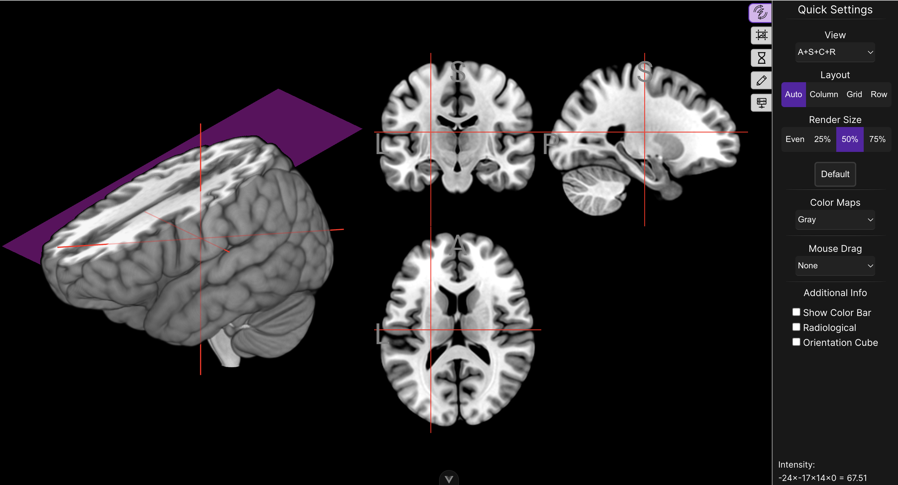
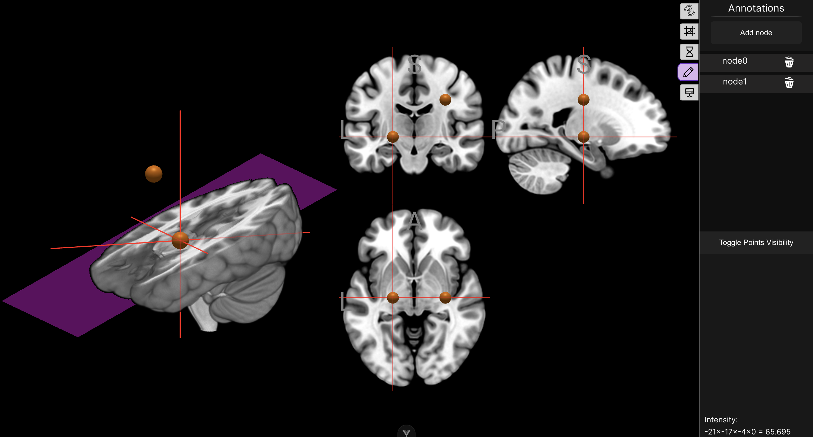
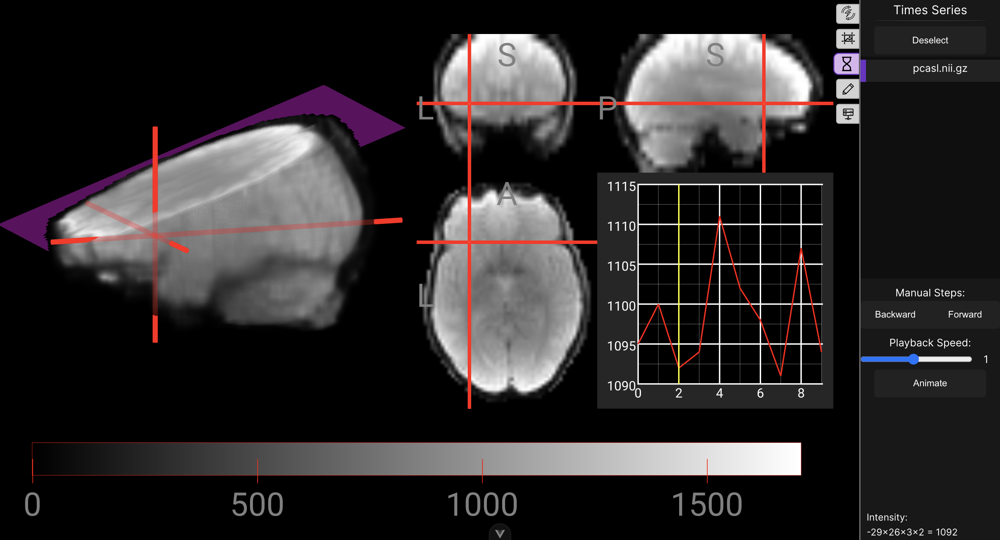
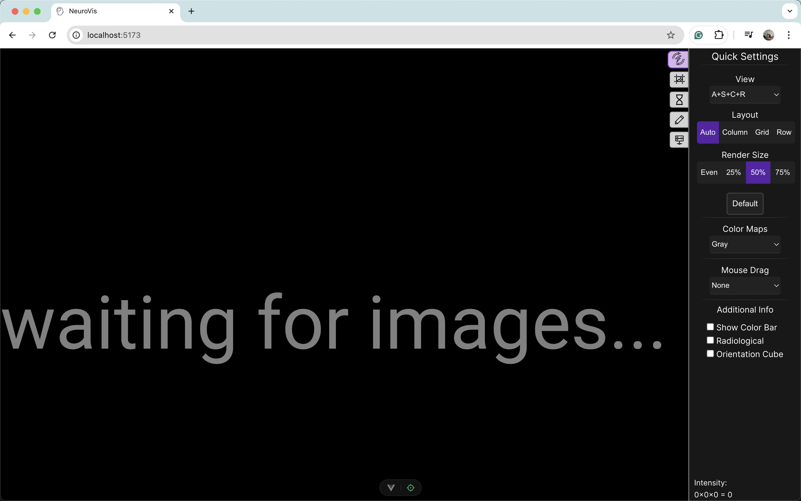

# NeuroVis 🧠

NeuroVis is a web-based neuroimaging visualization tool, it adds an UI overlay on top of [Niivue](https://github.com/niivue/niivue) rendering engine.

## Live

[https://github.com/niivue/niivue](https://github.com/niivue/niivue)

For server functionality check the [Server Section](#server)

## Tips

- When importing data with time series, remember to toggle the "Is 4D volume" checkbox

# Development

## Technologies

- Front-End: [Vue 3](https://vuejs.org/)
- Rendering: [Niivue](https://github.com/niivue/niivue)
- Build tool: [Vite](https://vite.dev/)
- State management: [Pinia](https://pinia.vuejs.org/)

## Development Setup

1. Clone this repo!

```
git clone
```

2. Install dependencies

```
npm install
```

3. Run local server

```
npm run dev
```

### Additional scripts

```
   "build": "run-p type-check \"build-only {@}\" --",
   "preview": "vite preview",
   "build-only": "vite build",
   "type-check": "vue-tsc --build",
   "lint": "eslint . --fix",
   "format": "prettier --write src/"
```

## Server

A python server was built to add the functionality to fetch files from a database, api or a local server. For it's development and how to run it, check the [NeuroServe](https://github.com/Carnaux/NeuroServe) repo.

# Screenshots

Initial Screen

[]()

Annotations

[]()

Time Series

[]()

# Recording walkthrough

Click to open

[](https://vimeo.com/1048624589/71d82750ca?share=copy)

# TODO

1. Add more options and finer controls to volume and mesh e.g.
   a. change colormap for individual volume/mesh
   b. opacity slider for individual volume/mesh
2. Add drawing to annotations.
3. Fetch graph data directly from file and display graph on a separate UI element.
4. UX improvements.
5. Adding more functionalities from Niivue.

## Credits & licenses

### Icons

<a class="link_pro" href="https://freeicons.io/provincial-electricity-authority/powerenergy-bolt-thunderbolt-electricity-icon-214946">Sumit-7080</a> on <a href="https://freeicons.io">freeicons.io</a>

<a class="link_pro" href="https://freeicons.io/line-hero-essentials/essentials-image-resize-scale-crop-icon-20459">www.wishforge.games</a> on <a href="https://freeicons.io">freeicons.io</a>

<a class="link_pro" href="https://freeicons.io/it-and-company-icons/it-animation-icon-icon">icon king1</a> on <a href="https://freeicons.io">freeicons.io</a>

<a class="link_pro" href="https://freeicons.io/essentials-user-interface/pencil-pen-edit-change-ui-icon-104267">Melvin ilham Oktaviansyah</a> on <a href="https://freeicons.io">freeicons.io</a>

<a class="link_pro" href="https://freeicons.io/basic-symbol/bin-remove-garbage-recycle-trash-delete-icon-38493">MD Badsha Meah</a> on <a href="https://freeicons.io">freeicons.io</a>

<a class="link_pro" href="https://freeicons.io/business-and-online-icons/eye-off-icon-icon">Raj Dev</a> on <a href="https://freeicons.io">freeicons.io</a>

<a class="link_pro" href="https://freeicons.io/science-and-education/intelligence-artificil-head-brain-mind-education-icon-523281">ColourCreatype</a> on <a href="https://freeicons.io">freeicons.io</a>
